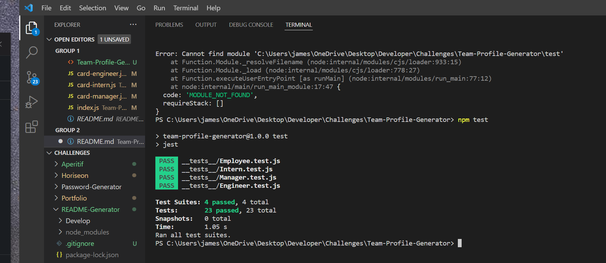

# Team-Profile-Generator

## User Story
- AS A manager
- I WANT to generate a webpage that displays my team's basic info
- SO THAT I have quick access to their emails and GitHub profiles

## Acceptance Criteria
- GIVEN a command-line application that accepts user input
- WHEN I am prompted for my team members and their information
- THEN an HTML file is generated that displays a nicely formatted team roster based on user input
- WHEN I click on an email address in the HTML
- THEN my default email program opens and populates the TO field of the email with the address
- WHEN I click on the GitHub username
- THEN that GitHub profile opens in a new tab
- WHEN I start the application
- THEN I am prompted to enter the team manager’s name, employee ID, email address, and office number
- WHEN I enter the team manager’s name, employee ID, email address, and office number
- THEN I am presented with a menu with the option to add an engineer or an intern or to finish building my team
- WHEN I select the engineer option
- THEN I am prompted to enter the engineer’s name, ID, email, and GitHub username, and I am taken back to the menu
- WHEN I select the intern option
- THEN I am prompted to enter the intern’s name, ID, email, and school, and I am taken back to the menu
- WHEN I decide to finish building my team
- THEN I exit the application, and the HTML is generated

## Link to code:
httpy://github/jamesbelk0/Team-Profile-Generator

## Link to screenshot/media:
- 
- A link to the video can be found here [Youtube](https://youtu.be/vpA5GBX1YfA)

## Description
1. Using inquirer, fs, jest and various tests generate a team builder profile page with various bits of information. Including a manager, engineer and intern role.

## Installation
- npm init
- npm install inquirer
- npm jest

## Usage
Run 'node index' to start the question prompt

## Contributor
- James Belk
- Tutor Luis (helped with structure and finalizing working code)

## Questions
If there are any issues or questions, please contact at:
- <jamesbelk0@gmail.com>
- [GitHub](https://github.com/jamesbelk0)
